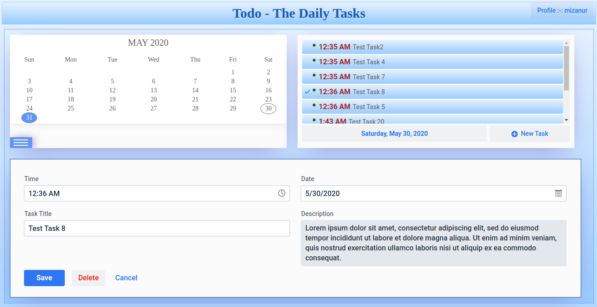
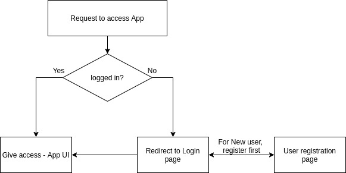

# Daily-Todo
Daily Todo app - developed using vaadin and spring boot


**Initial plan to have UI design as following**


**Developed UI snap**




**Application flow diagram**





## User Manual: 


## Running

Run the project with 

```
mvn package spring-boot:run
```

